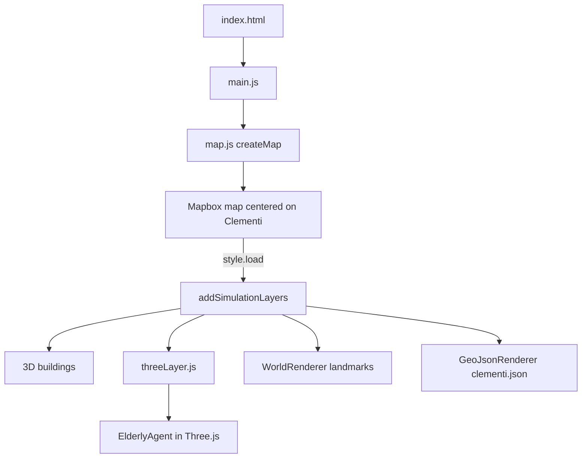

# 🚶 Accessibility Simulator

A digital twin of the Clementi MRT precinct built with **Mapbox GL JS**, **Three.js**, and **OpenStreetMap** to simulate accessibility and pedestrian movement.

## 📖 Overview

Accessibility Simulator is a web-based 3D simulation platform that models the physical environment around Clementi MRT. The project aims to visualize pedestrian infrastructure, transport networks, and accessibility features to support better urban planning and mobility analysis.

The simulator is being developed as part of the **Tech4City 2026** project.

---

## ✨ Features

### 🗺️ Interactive Map

- Mapbox GL JS integration
- Streets, Satellite, and Hybrid map styles
- 3D building visualization
- Navigation controls

### 🌍 Digital Twin

- Clementi MRT focused simulation
- Real-world OpenStreetMap data
- GeoJSON infrastructure layers

### 🚶 Transportation Network

- Vehicle roads
- Pedestrian footpaths
- MRT tracks
- MRT platforms
- Landmarks

### 🧊 3D Simulation

- Three.js integration
- Custom 3D rendering layer
- Initial elderly pedestrian model
- Ready for animated agents

---

## 🛠️ Technologies

- JavaScript (ES6)
- Vite
- Mapbox GL JS
- Three.js
- OpenStreetMap
- GeoJSON

---

## 📂 Project Structure

```
src/
│
├── data/
│   └── clementi.json
│
├── layers/
│   └── threeLayer.js
│
├── objects/
│   └── ElderlyAgent.js
│
├── world/
│   ├── GeoJsonRenderer.js
│   ├── WorldRenderer.js
│   └── renderers/
│
├── map.js
├── main.js
└── style.css
```

# Runtime Flow



---

## 🚀 Installation

Clone the repository:

```bash
git clone https://github.com/Nihamia/AccessibilitySimulator.git
```

Go into the project:

```bash
cd AccessibilitySimulator
```

Install dependencies:

```bash
npm install
```

Create a `.env` file:

```env
VITE_MAPBOX_TOKEN=YOUR_MAPBOX_ACCESS_TOKEN
```

Run the development server:

```bash
npm run dev
```

---

## 📍 Current Progress

✅ Mapbox integration

✅ Three.js integration

✅ 3D buildings

✅ GeoJSON renderer

✅ Landmark labels

✅ Transportation layer visualization

✅ Map style selector

🚧 Vehicle simulation

🚧 Pedestrian simulation

🚧 MRT simulation

🚧 Accessibility analysis

---

## 🎯 Future Development

- Animated buses
- Animated MRT trains
- Animated pedestrians
- Wheelchair routing
- Elderly movement simulation
- Accessibility heatmaps
- AI-based pathfinding
- Traffic simulation
- Digital twin analytics dashboard

---

## 📄 License

This project is for educational and research purposes.
